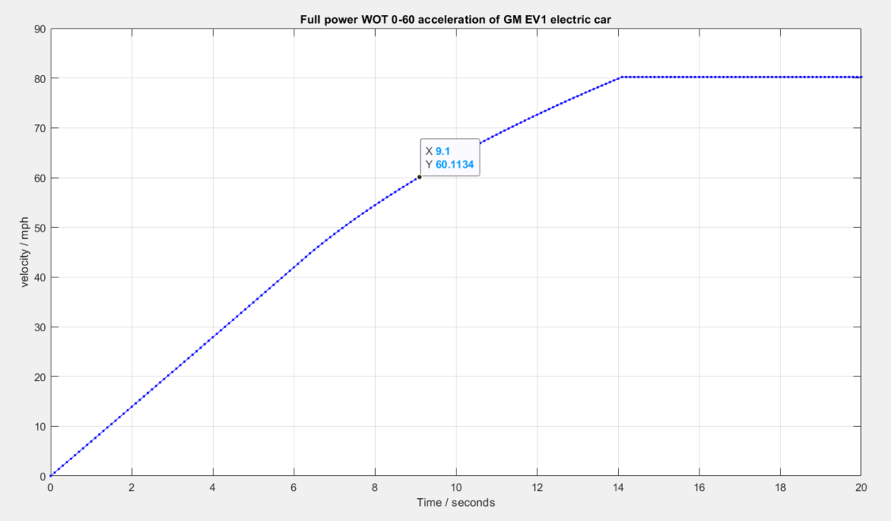
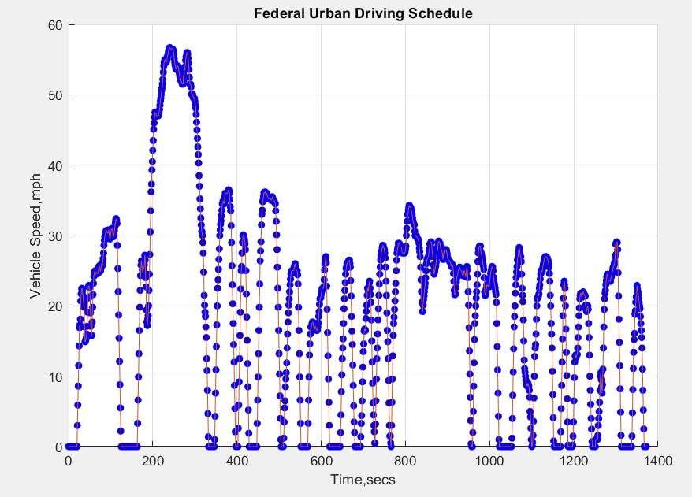
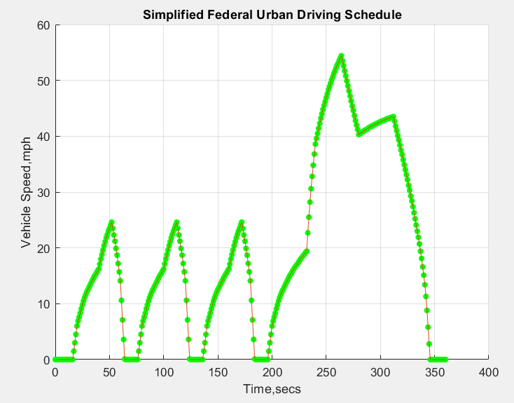
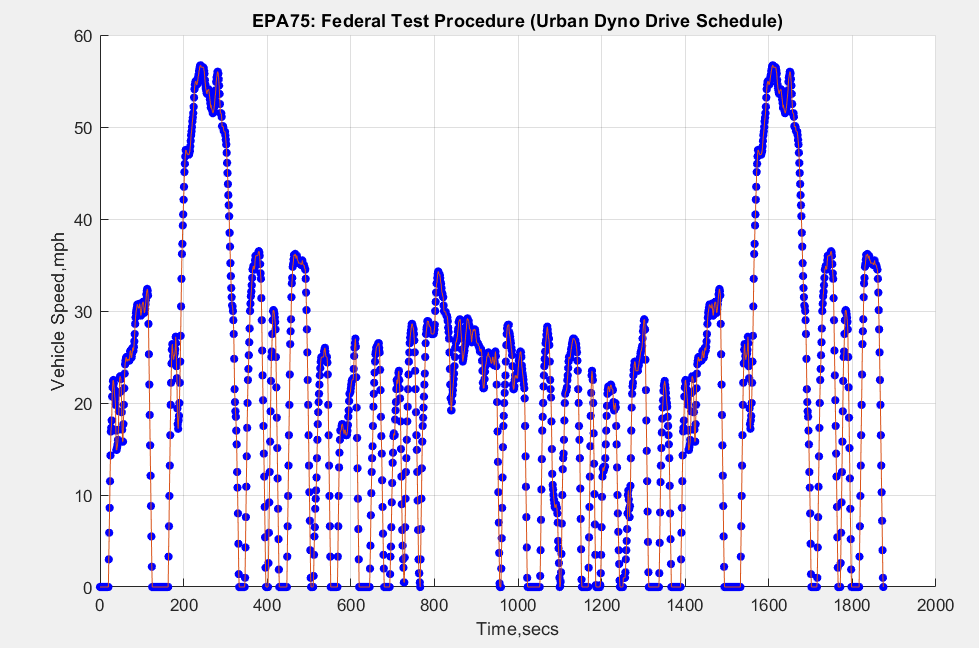
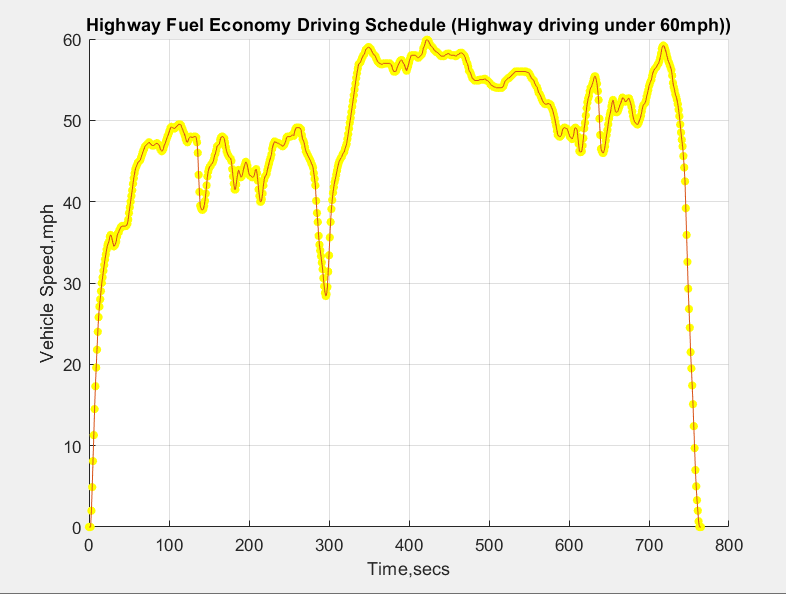
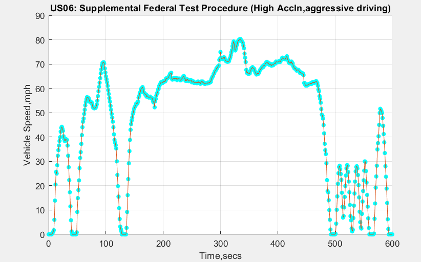
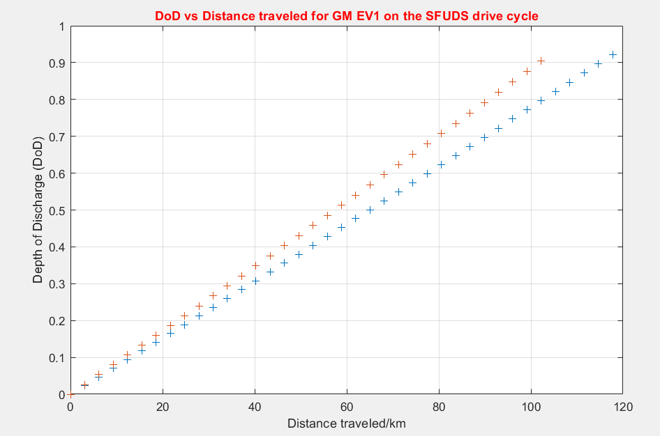

# xEV Powertrain Design Using MATLAB

## xEV - Battery Electric Vehicle, PlugIn Hybrid EV, Zero Emission EV

Design of xEV (electric and hybrid vehicles) powertrain using MATLAB, by creating math models and computer simulations (known as model-based design, MBD) to investigate and optimize the size of major components (e.g., battery, electric machine, …) for meeting set vehicle technical specification on vehicle performance.

## Wide Open Throttle, 0-60mph Acceleration Characteristics for GM EV1

  

## Drive Cycle Simulations

     

## Range Simulation for GM EV1 for SFUDS Drive cycle
Range = Distance traveled at 80% DoD

  
